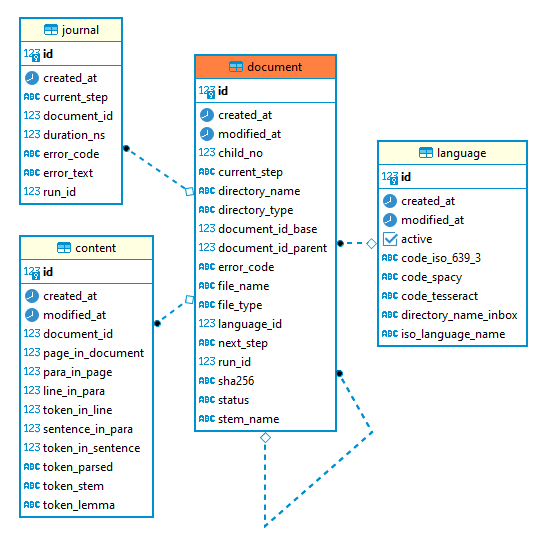
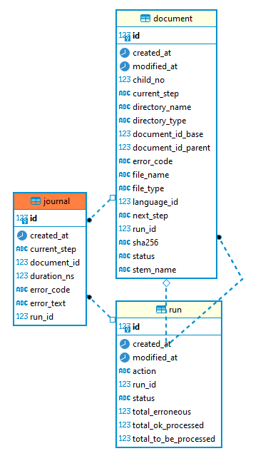
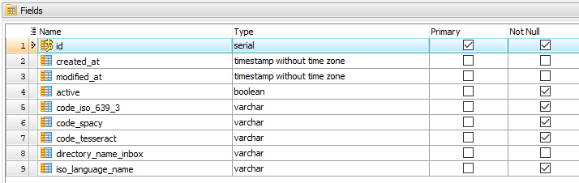
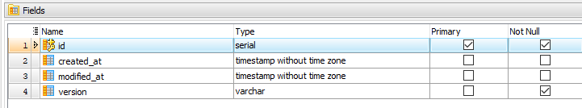

# DCR - Running - Data Model

----

## 1. Overview

Data storage is realised with the relational database management system [PostgreSQL](https://www.postgresql.org). 
**DCR** uses the official Docker image as provided by the PostgreSQL Docker Community on DockerHub - [see here](https://hub.docker.com/_/postgres). 
If required, a PostgreSQL container can be downloaded and created with the script `scripts/run_setup_postgresql`.

## 2. Database Schema

### 2.1 Database Table **`content`**

This database table contains the results from the parsing process:

### 2.2 Database Table **`document`**

This database table contains the document-related data:

### 2.3 Database Table **`journal`**

This database table contains document-related error message and performance data:

### 2.1 Database Table **`language`**

This database table controls the language-related document properties during processing:

### 2.1 Database Table **`run`**

This database table documents the executed processing runs in detail:

### 2.1 Database Table **`version`**

This database table is used to monitor the version status of the **DCR** database schema:

