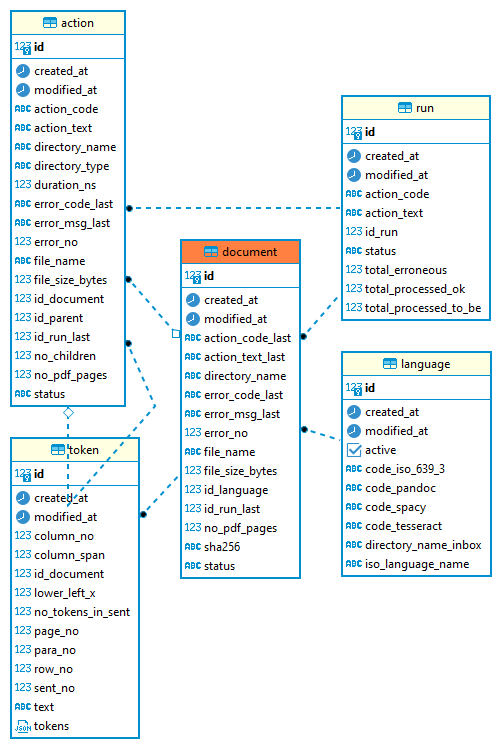
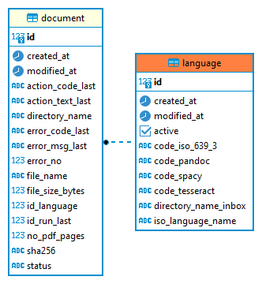

# DCR - Developing - Data Model

## 1. Overview

Data storage is realised with the relational database management system [PostgreSQL](https://www.postgresql.org){:target="_blank"}. 
**DCR** uses the official Docker image as provided by the PostgreSQL Docker Community on DockerHub - [see here](https://hub.docker.com/_/postgres){:target="_blank"}. 
If required, a PostgreSQL Docker image can be downloaded and a PostgreSQL Docker container can be created both with the script `scripts/run_setup_postgresql`.

## 2. Database Schema

### 2.1 Entity-relationship (ER) Diagram

#### 2.2.5 Database Table **`action`**

This database table contains the document-related data.

**Example rows**:

**Example columns**:

**ER Diagram**:

#### 2.2.5 Database Table **`document`**

This database table contains the document-related data.

**Example rows**:

**Example columns**:

**ER Diagram**:

#### 2.2.6 Database Table **`language`**

This database table controls the language-related document properties during processing.

**Example rows**:

**ER Diagram**:

#### 2.2.7 Database Table **`run`**

This database table documents the executed processing runs in detail.

**Example rows**:

**ER Diagram**:

#### 2.2.8 Database Table **`version`**

This database table is used to monitor the version status of the **DCR** database schema.

**Example row**:

**ER Diagram**:

#### 2.2.4 Database Table **`token`**

This database table contains the tokens determined by [spaCy](https://spacy.io){:target="_blank"} together with selected attributes.

**Example rows**:

**Example columns**:

**Example column `page_tokens`**:

**ER Diagram**:

