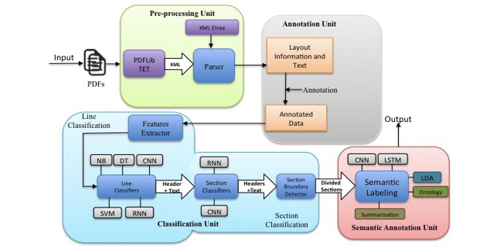
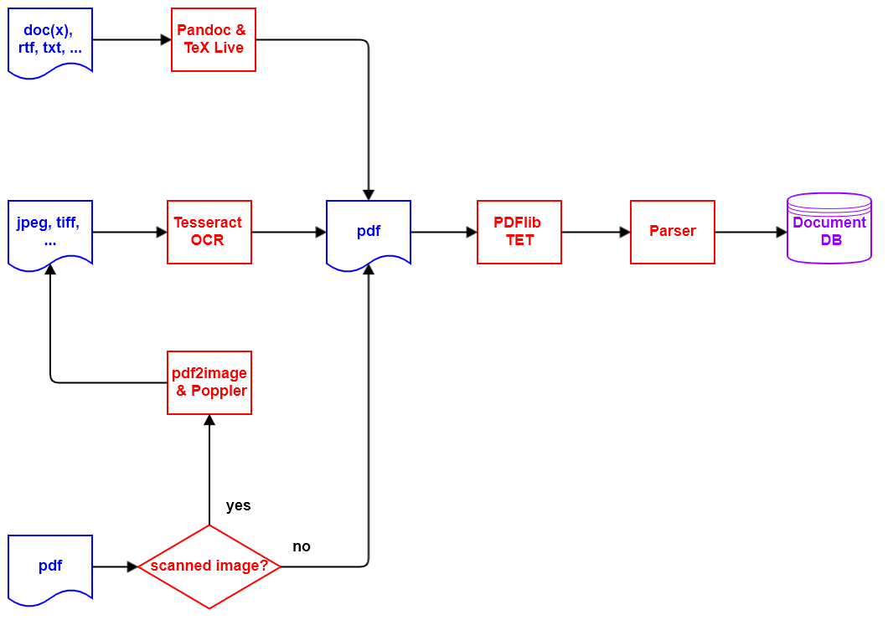

# DCR - Document Content Recognition

----

## 1. Introduction

Based on the paper "Unfolding the Structure of a Document using Deep Learning" ([Rahman and Finin, 2019](research.md#Rahman){:target="_blank"}), this software project attempts to automatically recognize the structure in arbitrary PDF documents and thus make them more searchable in a more qualified manner.
Documents not in PDF format are converted to PDF format using [Pandoc](https://pandoc.org){:target="_blank"}. 
Documents based on scanning which, therefore, do not contain text elements, are scanned and converted to PDF format using the [Tesseract OCR](https://github.com/tesseract-ocr/tesseract){:target="_blank"} software. 
This process applies to all image format files e.g. jpeg, tiff etc., as well as scanned images in PDF format.  

### 1.1 Rahman & Finin Paper

---

---

### 1.2 DCR Architecture

---

---

## 2. Detailed processing steps

### 2.1 Process the inbox directory

In the first step, the file directory **`inbox`** is checked for new document files. 
An entry is created in the **`document`** database table for each new document, showing the current processing status of the document. 
In addition, each processing step of a document is documented in the database table **`journal`**.
The new document files are processed based on their file extension as follows:

#### 2.1.1 File extension **`pdf`**

The module **`fitz`** from package [PyMuPDF](https://pymupdf.readthedocs.io/en/latest/module.html) is used to check whether the **`pdf`** document is a scanned image or not. 
A **`pdf`** document consisting of a scanned image is marked for conversion from **`pdf`** format to an image format and moved to the file directory **`ìnbox_accepted`**.
Other **`pdf`** documents are marked for further processing with the **`pdf`** parser and then also moved to the file directory **`ìnbox_accepted`**.
If, however, when checking the **`pdf`** document with **`fitz`**, it turns out that the document with the file extension **`pdf`** is not really a **`pdf`** document, then the document is moved to the file directory **`inbox_rejected`**.

#### 2.1.2 File extensions of documents for processing with Pandoc

Document files with the following file extensions are marked for converting to **`pdf`** format using [Pandoc](https://pandoc.org):

- **`csv`**
- **`doc`**
- **`docx`**
- **`epub`**
- **`htm`**
- **`html`**
- **`json`**
- **`md`**
- **`odt`**
- **`rst`**
- **`rtf`**
- **`txt`**

An exception are files with the file name **`README.md`**, which are ignored and not processed.

#### 2.1.3 File extensions of documents for processing with Tesseract OCR

Document files with the following file extensions are marked for converting to **`pdf`** format using [Tesseract OCR](https://github.com/tesseract-ocr/tesseract):

- **`bmp`**
- **`gif`**
- **`jp2`**
- **`jpeg`**
- **`jpg`**
- **`pmn`**
- **`png`**
- **`tiff`**
- **`webp`**

#### 2.1.4 Other file extensions of documents

Document files that do not fall into one of the previous categories are marked as faulty and moved to the file directory **`ìnbox_rejected`**.

## 3. Requirements

### 3.1 Operating System

Continuous delivery / integration (CD/CI) runs on **`Ubunto 18.04`**, **`Ubuntu 20.04`**, **`Windows Server 2019`** and **`Windows Server 2022`**.
This means that **`DCR`** also runs under **`Windows 10`** and **`Windows 11`**. 
In this case, only the functionality of the **`grep`** and **`make`** tools must be made available, e.g. via [Grep for Windows](http://gnuwin32.sourceforge.net/packages/grep.htm) or [Make for Windows](http://gnuwin32.sourceforge.net/packages/make.htm).

### 3.2 Python

Because of the use of the new typing features, **`Python`** version [3.10](https://docs.python.org/3/whatsnew/3.10.html){:target="_blank"} or higher is required.

## 4. Installation

1. Clone or copy the **`DCR`** repository from [here](https://github.com/KonnexionsGmbH/dcr){:target="_blank"}.

2. Switch to **`DCR`**:

    **`cd dcr`**

3. Install the necessary Python packages:

    **`make pipenv-prod`**

4. Create the **`DCR`** database with the script **`run_dcr`** and action **`db_c`**.

5. Optionally, adjustments can be made in the following configuration files:

   - **`logging_cfg.yaml`**: for the logging functionality

   - **`setup.cfg`**: for the **`DCR`** application in section **`dcr`**

### 4.1 **`setup.cfg`**

The customisable entries are:

    [dcr] 
    database_file = data/dcr.db
    directory_inbox = data/inbox
    directory_inbox_accepted = data/inbox_accepted
    directory_inbox_rejected = data/inbox_rejected

| Parameter                | Default value             | Description                             |
|--------------------------|---------------------------|-----------------------------------------|
| database_file            | **`data/dcr.db`**         | directory and name of the database file |
| directory_inbox          | **`data/inbox`**          | directory for the unprocessed documents |
| directory_inbox_accepted | **`data/inbox_accepted`** | directory for the accepted documents    |
| directory_inbox_rejected | **`data/inbox_rejected`** | directory for the rejected documents    |

## 5. Operation

**`DCR`** should be operated via the script **`run_dcr`**. 
The following actions are available:

| Action     | Process                                                                                                       |
|------------|---------------------------------------------------------------------------------------------------------------|
| **`all`**  | Run the complete processing of all new documents.                                                             |
| **`db_c`** | Create the database.                                                                                          |
| **`m_d`**  | Run the installation of the necessary 3rd party packages for development and run the development ecosystem.   |
| **`m_p`**  | Run the installation of the necessary 3rd party packages for production and compile all packages and modules. |
| **`p_i`**  | Process the inbox directory.                                                                                  |
