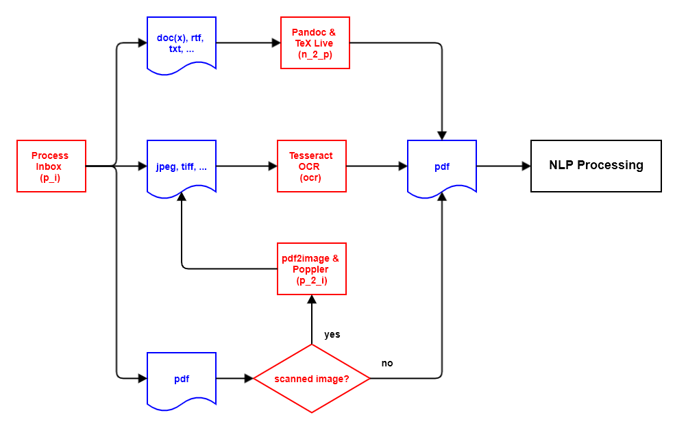
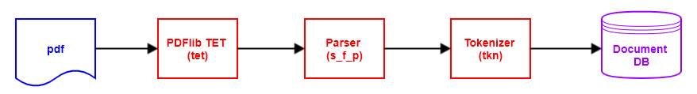

# DCR - Document Content Recognition

## 1. Introduction

Based on the paper "Unfolding the Structure of a Document using Deep Learning" (**[Rahman and Finin, 2019](https://arxiv.org/abs/1910.03678){:target="_blank"}**), this software project attempts to use various software techniques to automatically recognise the structure in any **`pdf`** documents and thus make them more searchable.

The processing logic is as follows:

- New documents are made available in the file directory **` inbox`**. If required, other language-related file directories can also be used (see section [Document Language](https://konnexionsgmbh.github.io/dcr/running_document_language){:target="_blank"}).
- Documents in a file format accepted by **DCR** are registered and moved to the file directory **`ìnbox_accepted`**. All other documents are registered and moved to the file directory **`ìnbox_rejected`**.
- Documents not in **`pdf`** format are converted to **`pdf`** format using [Pandoc](https://pandoc.org){:target="_blank"} and [TeX Live](https://www.tug.org/texlive){:target="_blank"}. 
- Documents based on scanning which, therefore, do not contain text elements, are scanned and converted to **`pdf`** format using the [Tesseract OCR](https://github.com/tesseract-ocr/tesseract){:target="_blank"} software. This process applies to all image format files e.g. **`jpeg`**, **`tiff`** etc., as well as scanned images in **`pdf`** format.  
- From all **`pdf`** documents, the text and associated metadata is extracted into a document-specific **`xml`** file using [PDFlib TET](https://www.pdflib.com/products/tet/){:target="_blank"}.
- The document-specific **`xml`** files are then parsed and the **DCR**-relevant contents are written to the **`JSON`** files. 
- From the **`JSON`** file(s) [spaCy](https://spacy.io){:target="_blank"} extracts qualified tokens and stores them either in a **`JSON`** file or in the database table **`token`**.

### 1.1 Rahman & Finin Paper

### 1.2 Supported File Types

**DCR** can handle the following file types based on the file extension:

- **`bmp`** [bitmap image file](https://en.wikipedia.org/wiki/BMP_file_format){:target="_blank"}
- **`csv`** [comma-separated values](https://en.wikipedia.org/wiki/Comma-separated_values){:target="_blank"}
- **`docx`** [Office Open XML](https://www.ecma-international.org/publications-and-standards/standards/ecma-376/){:target="_blank"}
- **`epub`** [e-book file format](https://www.w3.org/publishing/epub32/){:target="_blank"}
- **`gif`** [Graphics Interchange Format](https://www.w3.org/Graphics/GIF/spec-gif89a.txt){:target="_blank"}
- **`html`** [HyperText Markup Language](https://html.spec.whatwg.org){:target="_blank"}
- **`jp2`** [JPEG 2000](https://en.wikipedia.org/wiki/JPEG_2000){:target="_blank"}
- **`jpeg`** [Joint Photographic Experts Group](https://jpeg.org/jpeg/){:target="_blank"}
- **`odt`** [Open Document Format for Office Applications](https://www.oasis-open.org/committees/tc_home.php?wg_abbrev=office){:target="_blank"}
- **`pdf`** [Portable Document Format](https://www.iso.org/standard/75839.html){:target="_blank"}
- **`png`** [Portable Network Graphics](https://en.wikipedia.org/wiki/Portable_Network_Graphics){:target="_blank"}
- **`pnm`** [portable anymap format](https://en.wikipedia.org/wiki/Netpbm#File_formats){:target="_blank"}
- **`rst`** [reStructuredText (RST](https://docutils.sourceforge.io/rst.html){:target="_blank"}
- **`rtf`** [Rich Text Format](https://en.wikipedia.org/wiki/Rich_Text_Format){:target="_blank"}
- **`tif`** [Tag Image File Format](https://en.wikipedia.org/wiki/TIFF){:target="_blank"}
- **`tiff`** [Tag Image File Format](https://en.wikipedia.org/wiki/TIFF){:target="_blank"}
- **`webp`** [Image file format with lossless and lossy compression](https://developers.google.com/speed/webp){:target="_blank"}

## 2. Detailed processing actions

The documents to be processed are divided into individual steps, so-called actions. 
Each action has the task of changing the state of a document by transforming an input file format into a different output file format.
The database tables **`run`**, **`document`**, and **`action`** document the current state of a document, as well as the actions performed so far.
If an error occurs during the processing of the document, this is recorded in the database tables **`document`** and **`action`**.
During the next run with the same action, the faulty documents are also processed again.

### 2.1 Preprocessor

### 2.1.1 Preprocessor Architecture

### 2.1.2 Process the inbox directory (action: **`p_i`**)

In the first action, the file directory **`inbox`** is checked for new document files. 
An entry is created in the **`document`** database table for each new document, showing the current processing status of the document. 

The association of document and language is managed via subdirectories of the file folder **`inbox`**. 
In the database table **`language`**, the column **`directory_name_inbox`** specifies per language in which subdirectory the documents in this language are to be supplied. 
Detailed information on this can be found in the chapter **Running DCR** in the section **Document Language**.

The new document files are processed based on their file extension as follows:

#### 2.1.2.1 File extension **`pdf`**

The module **`fitz`** from package [PyMuPDF](https://pymupdf.readthedocs.io/en/latest/module.html){:target="_blank"} is used to check whether the **`pdf`** document is a scanned image or not. 
A **`pdf`** document consisting of a scanned image is marked for conversion from **`pdf`** format to an image format and moved to the file directory **`ìnbox_accepted`**.
Other **`pdf`** documents are marked for further processing with the **`pdf`** parser and then also moved to the file directory **`ìnbox_accepted`**.
If, however, when checking the **`pdf`** document with **`fitz`**, it turns out that the document with the file extension **`pdf`** is not really a **`pdf`** document, then the document is moved to the file directory **`inbox_rejected`**.

#### 2.1.2.2 File extensions of documents for processing with [Pandoc](https://pandoc.org){:target="_blank"} and [TeX Live](https://www.tug.org/texlive){:target="_blank"}

Document files with the following file extensions are moved to the file directory **`ìnbox_accepted`** and 
marked for converting to **`pdf`** format using [Pandoc](https://pandoc.org){:target="_blank"} and [TeX Live](https://www.tug.org/texlive){:target="_blank"}:

- **`csv`**
- **`docx`**
- **`epub`**
- **`html`**
- **`odt`**
- **`rst`**
- **`rtf`**

An exception are files with the file name **`README.md`**, which are ignored and not processed.

#### 2.1.2.3 File extensions of documents for processing with [Tesseract OCR](https://github.com/tesseract-ocr/tesseract){:target="_blank"}

Document files with the following file extensions are moved to the file directory **`ìnbox_accepted`** and marked for converting to **`pdf`** format using [Tesseract OCR](https://github.com/tesseract-ocr/tesseract){:target="_blank"}:

- **`bmp`**
- **`gif`**
- **`jp2`**
- **`jpeg`**
- **`png`**
- **`pnm`**
- **`tif`**
- **`tiff`**
- **`webp`**

#### 2.1.2.4 Other file extensions of documents

Document files that do not fall into one of the previous categories are marked as faulty and moved to the file directory **`ìnbox_rejected`**.

### 2.1.3 Convert **`pdf`** documents to image files (action: **`p_2_i`**)

This processing action only has to be carried out if there are new **`pdf`** documents in the document input that only consist of scanned images.
**`pdf`** documents consisting of scanned images must first be processed with OCR software in order to extract text they contain. 
Since [Tesseract OCR](https://github.com/tesseract-ocr/tesseract){:target="_blank"} does not support the **`pdf`** file format, such a **`pdf`** document must first be converted into one or more image files. 
This is done with the software [pdf2image](https://pypi.org/project/pdf2image){:target="_blank"}, which in turn is based on the [Poppler](https://poppler.freedesktop.org){:target="_blank"} software.

The processing of the original document (parent document) is then completed and the further processing is carried out with the newly created image file(s) (child document(s)).

Since an image file created here always contains only one page of a **`pdf`** document, a multi-page **`pdf`** document is distributed over several image files. 
After processing with [Tesseract OCR](https://github.com/tesseract-ocr/tesseract){:target="_blank"}, these separated files are then combined into one **`pdf`** document.

### 2.1.4 Convert appropriate image files to **`pdf`** files (action: **`ocr`**)

This processing action only has to be performed if there are new documents in the document entry that correspond to one of the document types listed in section 2.1.2.3.
In this processing action, the documents of this document types are converted to the **`pdf`** format using [Tesseract OCR](https://github.com/tesseract-ocr/tesseract){:target="_blank"}.

After processing with [Tesseract OCR](https://github.com/tesseract-ocr/tesseract){:target="_blank"}, the files split in the previous processing action are combined into a single **`pdf`** document.

### 2.1.5 Convert appropriate non-**`pdf`** documents to **`pdf`** files (action: **`n_2_p`**)

This processing action only has to be performed if there are new documents in the document entry that correspond to one of the document types listed in section 2.1.2.2.
In this processing action, the documents of this document types are converted to **`pdf`** format using [Pandoc](https://pandoc.org){:target="_blank"} and [TeX Live](https://www.tug.org/texlive){:target="_blank"}.

### 2.2 Natural Language Processing (NLP)

### 2.2.1 NLP Architecture

### 2.2.2 Extract text from **`pdf`** documents (action: **`tet`**)

In this processing action, the text of the **`pdf`** documents from sections 2.1.2.1, 2.1.4 and 2.1.5 are extracted and written to **`xml`** files in **`tetml`** format for each document.
The [PDFlib TET](https://www.pdflib.com/products/tet/){:target="_blank"} library is used for this purpose.

Depending on the configuration parameters **`tetml_page`** and **`tetml_word`**, up to three different **`xml`** files with different granularity can be created per document:

- **`tetml_line`**: granularity document `line` (generated by default),
- **`tetml_page`**: granularity document `page`,
- **`tetml_word`**: granularity document `word`.

The `page` variant and the `word` variant are both optional.

**Example extract from granularity `line`**:

    <Pages>
    <Page number="1" width="612.00" height="792.00">
    <Options>granularity=line</Options>
    <Content granularity="line" dehyphenation="false" dropcap="false" font="false" geometry="false" shadow="false" sub="false" sup="false">
    <Para>
     <Box llx="303.36" lly="746.40" urx="308.40" ury="756.48">
      <Line llx="303.36" lly="746.40" urx="308.40" ury="756.48">
       <Text>1</Text>
      </Line>
     </Box>
    </Para>
    <Para>
     <Box llx="126.00" lly="706.56" urx="153.84" ury="720.48">
      <Line llx="126.00" lly="706.56" urx="153.84" ury="720.48">
       <Text>1812</Text>
      </Line>
     </Box>
    </Para>
    <Para>
     <Box llx="126.00" lly="607.92" urx="420.27" ury="685.44">
      <Line llx="126.00" lly="671.52" urx="289.21" ury="685.44">
       <Text>GRIMM’S FAIRY TALES</Text>
      </Line>
      <Line llx="126.00" lly="639.36" urx="219.16" ury="653.28">
       <Text>CINDERELLA</Text>
      </Line>
      <Line llx="126.00" lly="607.92" urx="420.27" ury="621.84">
       <Text>Jacob Ludwig Grimm and Wilhelm Carl Grimm</Text>
      </Line>
     </Box>
    </Para>
    <Para>
     <Box llx="126.00" lly="460.32" urx="486.03" ury="589.44">
      <Line llx="126.00" lly="577.44" urx="485.98" ury="589.44">
       <Text>Grimm, Jacob (1785-1863) and Wilhelm (1786-1859) - German</Text>
      </Line>
      <Line llx="126.00" lly="562.80" urx="486.00" ury="574.80">
       <Text>philologists whose collection “Kinder- und Hausmarchen,” known</Text>
      </Line>

**Example extract from granularity `page`**:

    1
    1812
    GRIMM’S FAIRY TALES CINDERELLA Jacob Ludwig Grimm and Wilhelm Carl Grimm
    Grimm, Jacob (1785-1863) and Wilhelm (1786-1859) - German philologists whose collection “Kinder- und Hausmarchen,” known in English as “Grimm’s Fairy Tales,” is a timeless literary masterpiece. The brothers transcribed these tales directly from folk and fairy stories told to them by common villagers. Cinderella (1812) - The famous tale of a girl who is mistreated by her evil stepmother and step-sisters but goes on to marry the prince. This, the original “Cindrella,” differs greatly from many of its modern variations.
    CINDERELLA
    THERE WAS once a rich man whose wife lay sick, and when she felt her end drawing near she called to her only daughter to come near her bed, and said, “Dear child, be good and pious, and God will always take care of you, and I will look down upon you from heaven, and will be with you.” And then she closed her eyes and died. The maiden went every day to her mother’s grave and wept, and was always pious and good. When the winter came the snow covered the grave with a white covering, and when the sun came in the early spring and melted it away, the man took to himself another wife.
    The new wife brought two daughters home with her, and they were beautiful and fair in appearance, but at heart were black and ugly. And then began very evil times for the poor step-daughter.
    “Is the stupid creature to sit in the same room with us?” said they; “those who eat food must earn it. She is nothing but a kitchenmaid!” They took away her pretty dresses, and put on her an old gray kirtle, and gave her wooden shoes to wear.
    “Just look now at the proud princess, how she is decked out!” cried they laughing, and then they sent her into the kitchen. There she was obliged to do heavy work from morning to night, get up early in the morning, draw water, make the fires, cook, and wash. Besides that, the sisters did their utmost to torment her- mocking

**Example extract from granularity `word`**:

    <Page number="1" width="612.00" height="792.00">
    <Options>granularity=word tetml={elements={line}}</Options>
    <Content granularity="word" dehyphenation="false" dropcap="false" font="false" geometry="false" shadow="false" sub="false" sup="false">
    <Para>
     <Box llx="303.36" lly="746.40" urx="308.40" ury="756.48">
      <Line llx="303.36" lly="746.40" urx="308.40" ury="756.48">
       <Word>
        <Text>1</Text>
        <Box llx="303.36" lly="746.40" urx="308.40" ury="756.48"/>
       </Word>
      </Line>
     </Box>
    </Para>
    <Para>
     <Box llx="126.00" lly="706.56" urx="153.84" ury="720.48">
      <Line llx="126.00" lly="706.56" urx="153.84" ury="720.48">
       <Word>
        <Text>1812</Text>
        <Box llx="126.00" lly="706.56" urx="153.84" ury="720.48"/>
       </Word>
      </Line>
     </Box>
    </Para>
    <Para>
     <Box llx="126.00" lly="607.92" urx="420.27" ury="685.44">
      <Line llx="126.00" lly="671.52" urx="289.21" ury="685.44">
       <Word>
        <Text>GRIMM</Text>
        <Box llx="126.00" lly="671.52" urx="180.85" ury="685.44"/>
       </Word>
       <Word>
        <Text>’</Text>
        <Box llx="180.83" lly="671.52" urx="184.70" ury="685.44"/>
       </Word>
       <Word>
        <Text>S</Text>
        <Box llx="184.69" lly="671.52" urx="193.20" ury="685.44"/>
       </Word>

### 2.2.3 Store the parser result in a JSON file (action: **`s_p_j`**)

From the **xml** files of the granularity document `line` (`<file_name>_<doc_id>.line.xml`) or document `word` (`<file_name>_<doc_id>.word.xml`) created in the previous action, the text contained is now extracted with the existing metadata using **xml** parsing and stored in a **`JSON`** format in the database tables `content_tetml_line` and `content_tetml_word`.

The document `line` granularity attempts to type the lines. Details on this process can be found in section 4.
  
**Example extract from granularity `line`**:

    {
        "documentId": 1,
        "documentFileName": "Grimms_Fairy_Tales_Cinderella_Standalone.pdf",
        "noPagesInDocument": 6,
        "noParagraphsInDocument": 39,
        "noLinesInDocument": 248,
        "noLinesFooter": 0,
        "noLinesHeader": 1,
        "noLinesToc": 0,
        "pages": [
            {
                "pageNo": 1,
                "noParagraphsInPage": 9,
                "noLinesInPage": 37,
                "lines": [
                    {
                        "lineNo": 1,
                        "lineIndexPage": 0,
                        "lineIndexParagraph": 0,
                        "lineType": "h",
                        "lowerLeftX": 303.36,
                        "paragraphNo": 1,
                        "text": "1"
                    },
                    {
                        "lineNo": 1,
                        "lineIndexPage": 1,
                        "lineIndexParagraph": 0,
                        "lineType": "b",
                        "lowerLeftX": 126.0,
                        "paragraphNo": 2,
                        "text": "1812"
                    },
                    {
                        "lineNo": 1,
                        "lineIndexPage": 2,
                        "lineIndexParagraph": 0,
                        "lineType": "b",
                        "lowerLeftX": 126.0,
                        "paragraphNo": 3,
                        "text": "GRIMM\u2019S FAIRY TALES"
                    },
                    {
                        "lineNo": 2,
                        "lineIndexPage": 3,
                        "lineIndexParagraph": 1,
                        "lineType": "b",
                        "lowerLeftX": 126.0,
                        "paragraphNo": 3,
                        "text": "CINDERELLA"
                    },
                    {
                        "lineNo": 3,
                        "lineIndexPage": 4,
                        "lineIndexParagraph": 2,
                        "lineType": "b",
                        "lowerLeftX": 126.0,
                        "paragraphNo": 3,
                        "text": "Jacob Ludwig Grimm and Wilhelm Carl Grimm"
                    },
                    {
                        "lineNo": 1,
                        "lineIndexPage": 5,
                        "lineIndexParagraph": 0,
                        "lineType": "b",
                        "lowerLeftX": 126.0,
                        "paragraphNo": 4,
                        "text": "Grimm, Jacob (1785-1863) and Wilhelm (1786-1859) - German"
                    },
                    {
                        "lineNo": 2,
                        "lineIndexPage": 6,
                        "lineIndexParagraph": 1,
                        "lineType": "b",
                        "lowerLeftX": 126.0,
                        "paragraphNo": 4,
                        "text": "philologists whose collection \u201cKinder- und Hausmarchen,\u201d known"
                    },
                    {
                        "lineNo": 3,
                        "lineIndexPage": 7,
                        "lineIndexParagraph": 2,
                        "lineType": "b",
                        "lowerLeftX": 126.0,
                        "paragraphNo": 4,
                        "text": "in English as \u201cGrimm\u2019s Fairy Tales,\u201d is a timeless literary"
                    },

**Example extract from granularity `word`**:

    {
        "documentId": 1,
        "documentFileName": "Grimms_Fairy_Tales_Cinderella_Standalone.pdf",
        "noPagesInDocument": 6,
        "noParagraphsInDocument": 39,
        "noLinesInDocument": 248,
        "noWordsInDocument": 3267,
        "pages": [
            {
                "pageNo": 1,
                "noParagraphsInPage": 9,
                "noLinesInPage": 37,
                "noWordsInPage": 417,
                "paragraphs": [
                    {
                        "paragraphNo": 1,
                        "noLinesInParagraph": 1,
                        "noWordsInParagraph": 1,
                        "lines": [
                            {
                                "lineNo": 1,
                                "noWordsInLine": 1,
                                "words": [
                                    {
                                        "wordNo": 1,
                                        "text": "1"
                                    }
                                ]
                            }
                        ]
                    },
                    {
                        "paragraphNo": 2,
                        "noLinesInParagraph": 1,
                        "noWordsInParagraph": 1,
                        "lines": [
                            {
                                "lineNo": 1,
                                "noWordsInLine": 1,
                                "words": [
                                    {
                                        "wordNo": 1,
                                        "text": "1812"
                                    }
                                ]
                            }
                        ]
                    },
                    {
                        "paragraphNo": 3,
                        "noLinesInParagraph": 3,
                        "noWordsInParagraph": 13,
                        "lines": [
                            {
                                "lineNo": 1,
                                "noWordsInLine": 5,
                                "words": [
                                    {
                                        "wordNo": 1,
                                        "text": "GRIMM"
                                    },
                                    {
                                        "wordNo": 2,
                                        "text": "\u2019"
                                    },
                                    {
                                        "wordNo": 3,
                                        "text": "S"
                                    },
                                    {
                                        "wordNo": 4,
                                        "text": "FAIRY"
                                    },
                                    {
                                        "wordNo": 5,
                                        "text": "TALES"
                                    }
                                ]
                            },

### 2.2.4 Create qualified document tokens (action: **`tkn`**)

For tokenisation, [spaCy](https://spacy.io/usage/models){:target="_blank"} is used. 

The document text is made available to spaCy page by page.
Either the granularity document `line` or document `page` can be used for this.
With the granularity document `line`, the recognised headers and footers are left out of the token creation.

spaCy provides a number of attributes for the token. 
Details can be found [here](https://spacy.io/api/token#attributes){:target="_blank"} in the spaCy documentation.
The configuration parameters of the type `spacy_tkn_attr_...` control which of these attributes are stored to the database table `content_token`.
By default, the following attributes are stored:

- `spacy_tkn_attr_ent_iob_ `
- `spacy_tkn_attr_ent_type_ `
- `spacy_tkn_attr_i `
- `spacy_tkn_attr_is_currency `
- `spacy_tkn_attr_is_digit `
- `spacy_tkn_attr_is_oov `
- `spacy_tkn_attr_is_punct `
- `spacy_tkn_attr_is_sent_end `
- `spacy_tkn_attr_is_sent_start `
- `spacy_tkn_attr_is_stop `
- `spacy_tkn_attr_is_title `
- `spacy_tkn_attr_lemma_ `
- `spacy_tkn_attr_like_email `
- `spacy_tkn_attr_like_num `
- `spacy_tkn_attr_like_url `
- `spacy_tkn_attr_norm_ `
- `spacy_tkn_attr_pos_ `
- `spacy_tkn_attr_tag_ `
- `spacy_tkn_attr_text `
- `spacy_tkn_attr_whitespace_ `

In the event of an error, the original document is marked as erroneous and an explanatory entry is also written in the **`document`** table. 

**Example extract from granularity `line`**:

    {
        "documentId": 1,
        "documentFileName": "Grimms_Fairy_Tales_Cinderella_Standalone.pdf",
        "noPagesInDocument": 6,
        "noParagraphsInDocument": 33,
        "noSentencesInDocument": 121,
        "noLinesInDocument": 242,
        "noTokensInDocument": 1085,
        "pages": [
            {
                "pageNo": 1,
                "noParagraphsInPage": 8,
                "noSentencesInPage": 19,
                "noLinesInPage": 36,
                "noTokensInPage": 174,
                "paragraphs": [
                    {
                        "paragraphNo": 2,
                        "noSentencesInParagraph": 1,
                        "noLinesInParagraph": 1,
                        "noTokensInParagraph": 1,
                        "sentences": [
                            {
                                "sentenceNo": 1,
                                "lowerLeftX": 126.0,
                                "noTokensInSentence": 1,
                                "text": "1812",
                                "tokens": [
                                    {
                                        "tknEntIob_": "B",
                                        "tknEntType_": "DATE",
                                        "tknI": 0,
                                        "tknIsDigit": true,
                                        "tknIsOov": true,
                                        "tknIsSentEnd": true,
                                        "tknIsSentStart": true,
                                        "tknLemma_": "1812",
                                        "tknLikeNum": true,
                                        "tknNorm_": "1812",
                                        "tknPos_": "NUM",
                                        "tknTag_": "CD",
                                        "tknText": "1812"
                                    }
                                ]
                            }
                        ]
                    },
                    {
                        "paragraphNo": 3,
                        "noSentencesInParagraph": 1,
                        "noLinesInParagraph": 3,
                        "noTokensInParagraph": 10,
                        "sentences": [
                            {
                                "sentenceNo": 1,
                                "lowerLeftX": 126.0,
                                "noTokensInSentence": 10,
                                "text": "GRIMM\u2019S FAIRY TALES CINDERELLA Jacob Ludwig Grimm and Wilhelm Carl Grimm",
                                "tokens": [
                                    {
                                        "tknEntIob_": "B",
                                        "tknEntType_": "PERSON",
                                        "tknI": 0,
                                        "tknIsOov": true,
                                        "tknIsSentStart": true,
                                        "tknLemma_": "GRIMM",
                                        "tknNorm_": "grimm",
                                        "tknPos_": "PROPN",
                                        "tknTag_": "NNP",
                                        "tknText": "GRIMM"
                                    },
                                    {
                                        "tknEntIob_": "O",
                                        "tknI": 2,
                                        "tknIsOov": true,
                                        "tknLemma_": "fairy",
                                        "tknNorm_": "fairy",
                                        "tknPos_": "ADJ",
                                        "tknTag_": "JJ",
                                        "tknText": "FAIRY",
                                        "tknWhitespace_": " "
                                    },

## 3. Naming system of the auxiliary files

The processing actions are based on different flat files, each of which is generated from the original document on an action-related basis.
Apart from the **`JSON`** files optionally created during the 'tokenizer' action, these can be automatically deleted after error-free processing.

## 3.1 Action-related naming system

| Code    | Action                                        | File names                                            | 
|---------|-----------------------------------------------|-------------------------------------------------------|
| `p_i`   | process the inbox directory                   | `in :` `<ost>.<oft>`                                  |                                      
|         |                                               | `out:` `<ost>_<di>.<oft> `                            |                                       
| `p_2_i` | convert pdf documents to image files          | `in :` `<ost>_<di>.pdf`                               |                                       
|         |                                               | `out:` `<ost>_<di>.<jpeg / png>`                      |                                       
| `ocr`   | convert image files to pdf documents          | `in :` `<ost>_<di>.<oft>`                             | `                                     
|         |                                               | `or :` `<ost>_<di>.<jpeg / png>`                      |                                       
|         |                                               | `out:` `<ost>_<di>_<pn>.pdf`                          |                                       
|         |                                               | `and:` `<ost>_<di>_0.pdf`                             |                                       
| `n_2_p` | convert non-pdf documents to pdf documents    | `in :` `<ost>_<di>.<oft>`                             |                                       
|         |                                               | `out:` `<ost>_<di>.pdf`                               |                                      
| `tet`   | extract text and metdata from pdf documents   | `in :` `<ost>_<di>[_<pn> / _0].pdf`                   |                                       
|         |                                               | `out:` `<ost>_<di>[_<pn> / _0]_line.xml`              |                                       
|         |                                               | `and:` `<ost>_<di>[_<pn> / _0]_page.xml`              |                                       
|         |                                               | `and:` `<ost>_<di>[_<pn> / _0]_word.xml`              |                                       
| `s_p_j` | store the parser result in a **`JSON`** file  | `in :` `<ost>_<di>[_<pn> / _0]_line.xml`              |                                       
|         |                                               | `and:` `<ost>_<di>[_<pn> / _0]_page.xml`              |                                     
|         |                                               | `and:` `<ost>_<di>[_<pn> / _0]_word.xml`              |                                     
|         |                                               | `out:` `<ost>_<di>[_<pn> / _0]_line.json`             |                                      
|         |                                               | `and:` `<ost>_<di>[_<pn> / _0]_page.json`             |                                     
|         |                                               | `and:` `<ost>_<di>[_<pn> / _0]_word.json`             |                                     
| `tkn`   | create qualified document tokens              | `in :` `<ost>_<di>[_<pn> / _0]_line.json`             |                                      
|         |                                               | `out:` `<ost>_<di>[_<pn> / _0]_line_token.json`       |                                      

| Abbr.  | Meaning             |
|--------|---------------------|
| `oft`  | original file type  |
| `osn`  | original stem name  |
| `di`   | document identifier |
| `pn`   | page number         |

## 3.2 Examples

### 3.2.1 Possible intermediate files from a **`docx`** document:

    case_2_docx_route_inbox_pandoc_pdflib_2.docx

    case_2_docx_route_inbox_pandoc_pdflib_2.pdf

    case_2_docx_route_inbox_pandoc_pdflib_2.line.xml
    case_2_docx_route_inbox_pandoc_pdflib_2.page.xml
    case_2_docx_route_inbox_pandoc_pdflib_2.word.xml

    case_2_docx_route_inbox_pandoc_pdflib_2.line.json
    case_2_docx_route_inbox_pandoc_pdflib_2.page.json
    case_2_docx_route_inbox_pandoc_pdflib_2.word.json

    case_2_docx_route_inbox_pandoc_pdflib_2.line.token.json

### 3.2.2 Possible intermediate files from a **`jpg`** document:

    case_6_jpg_route_inbox_tesseract_pdflib_6.jpg

    case_6_jpg_route_inbox_tesseract_pdflib_6.pdf

    case_6_jpg_route_inbox_tesseract_pdflib_6.line.json
    case_6_jpg_route_inbox_tesseract_pdflib_6.page.json
    case_6_jpg_route_inbox_tesseract_pdflib_6.word.json

    case_6_jpg_route_inbox_tesseract_pdflib_6.line.xml
    case_6_jpg_route_inbox_tesseract_pdflib_6.page.xml
    case_6_jpg_route_inbox_tesseract_pdflib_6.word.xml

    case_6_jpg_route_inbox_tesseract_pdflib_6.line.token.json

### 3.2.3 Possible intermediate files from a proper **`pdf`** document:

    case_3_pdf_text_route_inbox_pdflib_3.pdf

    case_3_pdf_text_route_inbox_pdflib_3.line.xml
    case_3_pdf_text_route_inbox_pdflib_3.page.xml
    case_3_pdf_text_route_inbox_pdflib_3.word.xml

    case_3_pdf_text_route_inbox_pdflib_3.line.json
    case_3_pdf_text_route_inbox_pdflib_3.page.json
    case_3_pdf_text_route_inbox_pdflib_3.word.json

    case_3_pdf_text_route_inbox_pdflib_3.line.token.json

### 3.2.4 Possible intermediate files from a single page scanned image **`pdf`** document:

    case_4_pdf_image_small_route_inbox_pdf2image_tesseract_pdflib_4.pdf

    case_4_pdf_image_small_route_inbox_pdf2image_tesseract_pdflib_4_1.jpeg

    case_4_pdf_image_small_route_inbox_pdf2image_tesseract_pdflib_4_1.pdf

    case_4_pdf_image_small_route_inbox_pdf2image_tesseract_pdflib_4_1.line.json
    case_4_pdf_image_small_route_inbox_pdf2image_tesseract_pdflib_4_1.page.json
    case_4_pdf_image_small_route_inbox_pdf2image_tesseract_pdflib_4_1.word.json

    case_4_pdf_image_small_route_inbox_pdf2image_tesseract_pdflib_4_1.line.xml
    case_4_pdf_image_small_route_inbox_pdf2image_tesseract_pdflib_4_1.page.xml
    case_4_pdf_image_small_route_inbox_pdf2image_tesseract_pdflib_4_1.word.xml

    case_4_pdf_image_small_route_inbox_pdf2image_tesseract_pdflib_4_1.line.token.json

### 3.2.5 Possible intermediate files from a multi page scanned image **`pdf`** document:

    case_5_pdf_image_large_route_inbox_pdf2image_tesseract_pypdf2_pdflib_5.pdf

    case_5_pdf_image_large_route_inbox_pdf2image_tesseract_pypdf2_pdflib_5_1.jpeg
    case_5_pdf_image_large_route_inbox_pdf2image_tesseract_pypdf2_pdflib_5_2.jpeg

    case_5_pdf_image_large_route_inbox_pdf2image_tesseract_pypdf2_pdflib_5_1.pdf
    case_5_pdf_image_large_route_inbox_pdf2image_tesseract_pypdf2_pdflib_5_2.pdf
    case_5_pdf_image_large_route_inbox_pdf2image_tesseract_pypdf2_pdflib_5_0.pdf

    case_5_pdf_image_large_route_inbox_pdf2image_tesseract_pypdf2_pdflib_5_0.line.json
    case_5_pdf_image_large_route_inbox_pdf2image_tesseract_pypdf2_pdflib_5_0.page.json
    case_5_pdf_image_large_route_inbox_pdf2image_tesseract_pypdf2_pdflib_5_0.word.json

    case_5_pdf_image_large_route_inbox_pdf2image_tesseract_pypdf2_pdflib_5_0.line.xml
    case_5_pdf_image_large_route_inbox_pdf2image_tesseract_pypdf2_pdflib_5_0.page.xml
    case_5_pdf_image_large_route_inbox_pdf2image_tesseract_pypdf2_pdflib_5_0.word.xml

    case_5_pdf_image_large_route_inbox_pdf2image_tesseract_pypdf2_pdflib_5_0.line.token.json

## 4 Line Typing Algorithms

The granularity of the document `line` tries to classify the individual lines or sentences.
The possible line types are :

| line type | Meaning                                           |
|-----------|---------------------------------------------------|
| b         | non-classifiable line, i.e. normal text body line |
| f         | footer line                                       |
| h         | header line                                       |
| lb        | line of a bulleted list                           |
| ln        | line of a numbered list                           |
| tab       | non-classifiable line of a table                  |
| toc       | line of a table of content                        |

### 4.1 Footers

The parameters that control the classification in footer lines are:

- `line_footer_max_distance = 3`
- `line_footer_max_lines = 3`

#### 4.1.1 `line_footer_max_lines`

This parameter controls the number of lines from the bottom of the page to be analyzed as possible candidates for footers.
With the value zero the classification of footers is prevented.

#### 4.1.2 `line_footer_max_distance`

The degree of similarity of rows is determined by means of the [Levenstein distance](https://en.wikipedia.org/wiki/Levenshtein_distance){:target="_blank"}. 
The value zero stands for identical lines. 
The larger the Levenshtein distance, the more different the rows are. 
If the header lines do not contain a page numbers, then the parameter should be set to `0`.

#### 4.1.3 Algorithm

1. On all pages, the last line `n`, the line `n-1`, etc. are compared up to the maximum specified line. 
2. The Levenshtein distance is determined for each pair of lines in the specified range for each current page and the previous page.
3. The line is considered a footer if, except for pages `1` and `2` and pages `n-1` and `n`, the Levenshtein distance is not greater than the specified maximum value.

### 4.2 Header

The parameters that control the classification in header lines are:

- `line_header_max_distance = 3`
- `line_header_max_lines = 3`

#### 4.2.1 `line_header_max_lines`

This parameter controls the number of lines from the top of the page to be analyzed as possible candidates for headers.
A value of zero prevents the classification of headers.

#### 4.2.2 `line_header_max_distance`

The degree of similarity of rows is determined by means of the [Levenstein distance](https://en.wikipedia.org/wiki/Levenshtein_distance){:target="_blank"}. 
The value zero stands for identical lines. 
The larger the Levenshtein distance, the more different the rows are. 
If the footer lines contain a page number, then depending on the number of pages in the document, the following values are useful:

| document pages | Levenshtein distance |
|----------------|----------------------|
 | < 10           | 1                    |
 | < 100          | 2                    |
 | < 1000         | 3                    |

#### 4.2.3 Algorithm

1. On all pages, the first line, the second line, etc. are compared up to the maximum specified line. 
2. The Levenshtein distance is determined for each pair of lines in the specified range for each current page and the previous page.
3. The line is considered a header if, except for pages `1` and `2` and pages `n-1` and `n`, the Levenshtein distance is not greater than the specified maximum value.

### 4.3 TOC (Table of Content)

The parameters that control the classification in table of content are:

- `toc_last_page = 3`
- `toc_min_entries = 3`

#### 4.3.1 `toc_last_page`

This parameter sets the number of pages that will be searched for a table of contents from the beginning of the document.
A value of zero prevents the search for a table of contents.

#### 4.3.2 `toc_min_entries`

This parameter defines the minimum number of entries that a table of contents must contain.

#### 4.3.3 Algorithm

1. **Table-based: a table with the following properties is searched for**:

   - except for the first row, the last column of the table must contain an integer greater than zero,
   - the number found there must be ascending,
   - the number must not be greater than the last page number of the document, and
   - if such a table was found, then the algorithm ends here

2. **Line-based: a block of lines with the following properties is searched here**:

   - the last token from each line must contain an integer greater than zero,
   - the number found there must be ascending, and
   - the number must not be greater than the last page number of the document.
