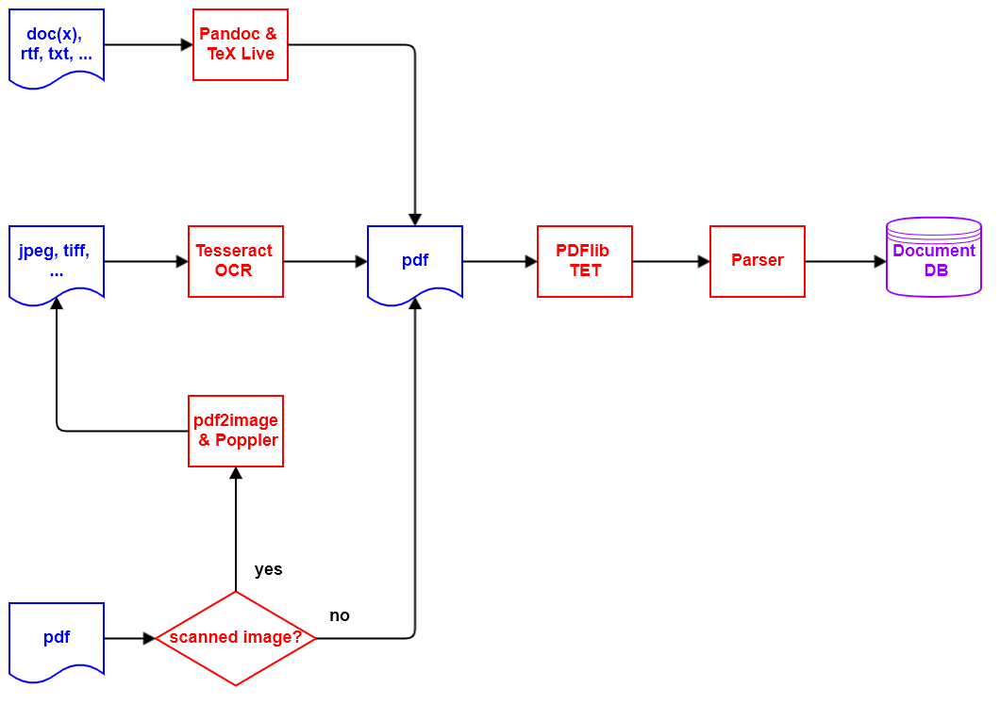

# DCR - Document Content Recognition

----

## 1. Introduction

Based on the paper "Unfolding the Structure of a Document using Deep Learning" ([Rahman and Finin, 2019](developing_research_notes.md#Rahman){:target="_blank"}), this software project attempts to automatically recognize the structure in arbitrary **`pdf`** documents and thus make them better searchable in a more qualified manner.

The processing logic is as follows:

- New documents are made available in the file directory **` inbox`**. If required, other language-related file directories can also be used (see section [Document Language](https://konnexionsgmbh.github.io/dcr/running_document_language){:target="_blank"}).
- Documents in a file format accepted by **DCR** are registered and moved to the file directory **`ìnbox_accepted`**. All other documents are registered and moved to the file directory **`ìnbox_rejected`**.
- Documents not in **`pdf`** format are converted to **`pdf`** format using [Pandoc](https://pandoc.org){:target="_blank"} and [TeX Live](https://www.tug.org/texlive){:target="_blank"}. 
- Documents based on scanning which, therefore, do not contain text elements, are scanned and converted to **`pdf`** format using the [Tesseract OCR](https://github.com/tesseract-ocr/tesseract){:target="_blank"} software. This process applies to all image format files e.g. **`jpeg`**, **`tiff`** etc., as well as scanned images in **`pdf`** format.  
- From all **`pdf`** documents, the text and associated metadata is extracted into a document-specific **`xml`** file using [PDFlib TET](https://www.pdflib.com/products/tet/){:target="_blank"}.
- The document-specific **`xml`** files are then parsed and the **DCR**-relevant contents are written to the database tables **`content`** and  **`document`**. 

### 1.1 Rahman & Finin Paper

### 1.2 Supported File Types

**DCR** can handle the following file types based on the file extension:

- **`bmp`** [bitmap image file](https://en.wikipedia.org/wiki/BMP_file_format){:target="_blank"}
- **`csv`** [comma-separated values](https://en.wikipedia.org/wiki/Comma-separated_values){:target="_blank"}
- **`docx`** [Office Open XML](https://www.ecma-international.org/publications-and-standards/standards/ecma-376/){:target="_blank"}
- **`epub`** [e-book file format](https://www.w3.org/publishing/epub32/){:target="_blank"}
- **`gif`** [Graphics Interchange Format](https://www.w3.org/Graphics/GIF/spec-gif89a.txt){:target="_blank"}
- **`html`** [HyperText Markup Language](https://html.spec.whatwg.org){:target="_blank"}
- **`jp2`** [JPEG 2000](https://en.wikipedia.org/wiki/JPEG_2000){:target="_blank"}
- **`jpeg`** [Joint Photographic Experts Group](https://jpeg.org/jpeg/){:target="_blank"}
- **`odt`** [Open Document Format for Office Applications](https://www.oasis-open.org/committees/tc_home.php?wg_abbrev=office){:target="_blank"}
- **`pdf`** [Portable Document Format](https://www.iso.org/standard/75839.html){:target="_blank"}
- **`png`** [Portable Network Graphics](https://en.wikipedia.org/wiki/Portable_Network_Graphics){:target="_blank"}
- **`pnm`** [portable anymap format](https://en.wikipedia.org/wiki/Netpbm#File_formats){:target="_blank"}
- **`rst`** [reStructuredText (RST](https://docutils.sourceforge.io/rst.html){:target="_blank"}
- **`rtf`** [Rich Text Format](https://en.wikipedia.org/wiki/Rich_Text_Format){:target="_blank"}
- **`tif`** [Tag Image File Format](https://en.wikipedia.org/wiki/TIFF){:target="_blank"}
- **`tiff`** [Tag Image File Format](https://en.wikipedia.org/wiki/TIFF){:target="_blank"}
- **`webp`** [Image file format with lossless and lossy compression](https://developers.google.com/speed/webp){:target="_blank"}

## 2. Detailed processing steps

### 2.1 Preprocessor

### 2.1.1 Preprocessor Architecture

### 2.1.2 Process the inbox directory (step: **`p_i`**)

In the first step, the file directory **`inbox`** is checked for new document files. 
An entry is created in the **`document`** database table for each new document, showing the current processing status of the document. 

The association of document and language is managed via subdirectories of the file folder **`inbox`**. 
In the database table **`language`**, the column **`directory_name_inbox`** specifies per language in which subdirectory the documents in this language are to be supplied. 
Detailed information on this can be found in the chapter **Running DCR** in the section **Document Language**.

The new document files are processed based on their file extension as follows:

#### 2.1.2.1 File extension **`pdf`**

The module **`fitz`** from package [PyMuPDF](https://pymupdf.readthedocs.io/en/latest/module.html){:target="_blank"} is used to check whether the **`pdf`** document is a scanned image or not. 
A **`pdf`** document consisting of a scanned image is marked for conversion from **`pdf`** format to an image format and moved to the file directory **`ìnbox_accepted`**.
Other **`pdf`** documents are marked for further processing with the **`pdf`** parser and then also moved to the file directory **`ìnbox_accepted`**.
If, however, when checking the **`pdf`** document with **`fitz`**, it turns out that the document with the file extension **`pdf`** is not really a **`pdf`** document, then the document is moved to the file directory **`inbox_rejected`**.

#### 2.1.2.2 File extensions of documents for processing with [Pandoc](https://pandoc.org){:target="_blank"} and [TeX Live](https://www.tug.org/texlive){:target="_blank"}

Document files with the following file extensions are moved to the file directory **`ìnbox_accepted`** and 
marked for converting to **`pdf`** format using [Pandoc](https://pandoc.org){:target="_blank"} and [TeX Live](https://www.tug.org/texlive){:target="_blank"}:

- **`csv`**
- **`docx`**
- **`epub`**
- **`html`**
- **`odt`**
- **`rst`**
- **`rtf`**

An exception are files with the file name **`README.md`**, which are ignored and not processed.

#### 2.1.2.3 File extensions of documents for processing with [Tesseract OCR](https://github.com/tesseract-ocr/tesseract){:target="_blank"}

Document files with the following file extensions are moved to the file directory **`ìnbox_accepted`** and marked for converting to **`pdf`** format using [Tesseract OCR](https://github.com/tesseract-ocr/tesseract){:target="_blank"}:

- **`bmp`**
- **`gif`**
- **`jp2`**
- **`jpeg`**
- **`png`**
- **`pnm`**
- **`tif`**
- **`tiff`**
- **`webp`**

#### 2.1.2.4 Other file extensions of documents

Document files that do not fall into one of the previous categories are marked as faulty and moved to the file directory **`ìnbox_rejected`**.

### 2.1.3 Convert **`pdf`** documents to image files (step: **`p_2_i`**)

This processing step only has to be carried out if there are new **`pdf`** documents in the document input that only consist of scanned images.
**`pdf`** documents consisting of scanned images must first be processed with OCR software in order to extract text they contain. 
Since [Tesseract OCR](https://github.com/tesseract-ocr/tesseract){:target="_blank"} does not support the **`pdf`** file format, such a **`pdf`** document must first be converted into one or more image files. 
This is done with the software [pdf2image](https://pypi.org/project/pdf2image){:target="_blank"}, which in turn is based on the [Poppler](https://poppler.freedesktop.org){:target="_blank"} software.
The processing of the original document (parent document) is then completed and the further processing is carried out with the newly created image file(s) (child document(s)).

Since an image file created here always contains only one page of a **`pdf`** document, a multi-page **`pdf`** document is distributed over several image files. 
After processing with [Tesseract OCR](https://github.com/tesseract-ocr/tesseract){:target="_blank"}, these separated files are then combined into one **`pdf`** document.

### 2.1.4 Convert appropriate image documents to **`pdf`** files (step: **`ocr`**)

This processing step only has to be performed if there are new documents in the document entry that correspond to one of the document types listed in section 2.1.3.
In this processing step, the document types listed in section 2.1.3 are converted to **`pdf`** format 
using [Tesseract OCR](https://github.com/tesseract-ocr/tesseract){:target="_blank"}.
In case of success the processing of the original document (parent document) is then completed and the further processing is carried out with the newly created **`pdf`** file (child document).
In the event of an error, the original document is marked as erroneous and an explanatory entry is also written in the **`document`** table. 

After processing with [Tesseract OCR](https://github.com/tesseract-ocr/tesseract){:target="_blank"}, the files split in the previous processing step are combined into a single **`pdf`** document.

### 2.1.5 Convert appropriate non-pdf documents to **`pdf`** files (step: **`n_2_p`**)

This processing step only has to be performed if there are new documents in the document entry that correspond to one of the document types listed in section 2.1.2.
In this processing step, the document types listed in section 2.1.2 are converted to **`pdf`** format 
using [Pandoc](https://pandoc.org){:target="_blank"} and [TeX Live](https://www.tug.org/texlive){:target="_blank"}.
In case of success the processing of the original document (parent document) is then completed and the further processing is carried out with the newly created **`pdf`** file (child document).
In the event of an error, the original document is marked as erroneous and an explanatory entry is also written in the **`document`** table. 

### 2.1.6 Extract text from **`pdf`** documents (step: **`tet`**)

In this processing step, the text of the **`pdf`** documents from 2.1.1, 2.3 and 2.4 are extracted and written to an **`xml`** file in **`tetml`** format for each document.
The [PDFlib TET](https://www.pdflib.com/products/tet/){:target="_blank"} library is used for this purpose.
In case of success the processing of the original document (parent document) is then completed and the further processing is carried out with the newly created **`xml`** file (child document).
In the event of an error, the original document is marked as erroneous and an explanatory entry is also written in the **`document`** table. 

### 2.2 TBD ...

