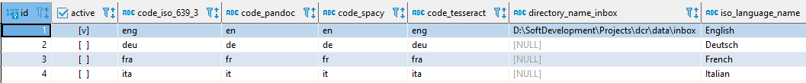
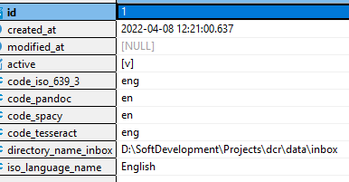

# DCR - Running - Document Language

## 1. Overview

**`DCR`** supports the processing of documents in different languages. 
The supported languages must be accepted by [Pandoc](https://pandoc.org){:target="_blank"} respectively [Babel](http://mirrors.ctan.org/macros/latex/required/babel/base/babel.pdf){:target="_blank"}, [spaCy](https://spacy.io/usage/models){:target="_blank"} and [Tesseract OCR](https://tesseract-ocr.github.io/tessdoc/Data-Files-in-different-versions.html){:target="_blank"}. 
Furthermore, for each of the languages in question there must be a corresponding entry in the database table **`language`**.

## 2. Database Table **`language`**

The active languages in the database table **`language`** control the allocation of the documents to a language. 
Each document language must have its own entry in this table. 
The documents in a particular language are expected in the subdirectory to the **`inbox`** or as defined in the **`directory_name_inbox`** column.

The entry for the standard language **`English`** is created automatically when the database is set up. 
In the JSON file **`initial_database_data`**, the languages German, French and Italian are also predefined but in the inactive state. 
The chosen document languages must now either be activated in this file or, if not yet available, added here. 

Example entry for the document language French:

    {
      "row": [
        {
          "columnName": "active",
          "columnValue": false
        },
        {
          "columnName": "code_iso_639_3",
          "columnValue": "fra"
        },
        {
          "columnName": "code_pandoc",
          "columnValue": "fr"
        },
        {
          "columnName": "code_spacy",
          "columnValue": "fr"
        },
        {                                   
          "columnName": "code_tesseract",
          "columnValue": "fra"
        },
        {
          "columnName": "directory_name_inbox",
          "columnValue": null
        },
        {
          "columnName": "iso_language_name",
          "columnValue": "French"
        }
      ]
    },

| Column               | Description                                                                                                                                                                                                                                                                                                                                                                         |
|----------------------|-------------------------------------------------------------------------------------------------------------------------------------------------------------------------------------------------------------------------------------------------------------------------------------------------------------------------------------------------------------------------------------|
| active               | active language - true or false                                                                                                                                                                                                                                                                                                                                                     |
| code_iso_639_3       | three-letter codes, the same as 639-2/T for languages,  but with distinct codes for each variety of an ISO 639 macrolanguage                                                                                                                                                                                                                                                     |
| code_pandoc          | the language code as used in [Pandoc](https://pandoc.org){:target="_blank"} respectively [Babel - IETF BCP 47](http://mirrors.ctan.org/macros/latex/required/babel/base/babel.pdf){:target="_blank"}, [spaCy](https://spacy.io/usage/models){:target="_blank"} and [Tesseract OCR](https://tesseract-ocr.github.io/tessdoc/Data-Files-in-different-versions.html){:target="_blank"} |
| code_spacy           | the language code as used in [spaCy](https://spacy.io/usage/models){:target="_blank"}                                                                                                                                                                                                                                                                                               |
| code_tesseract       | the language code as used in [Tesseract OCR](https://github.com/tesseract-ocr/tesseract){:target="_blank"}                                                                                                                                                                                                                                                                          |
| directory_name_inbox | optional the name of the file directory relative to the **`inbox`** -  if missing the content of the column **`iso_language_name`** is used                                                                                                                                                                                                                                      |
| iso_language_name    | the name of the language according to **`ISO 639-1`**                                                                                                                                                                                                                                                                                                                               |

## 3. Default Document Language

The default document language is English. 
The corresponding entry in the database table language is created internally with the following contents:

| Column               | Content             |
|----------------------|---------------------|
| active               | true                |
| code_iso_639_3       | eng                 |
| code_pandoc          | en                  |
| code_spacy           | en                  |
| code_tesseract       | eng                 |
| directory_name_inbox | the inbox directory |
| iso_language_name    | English             |
